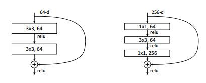
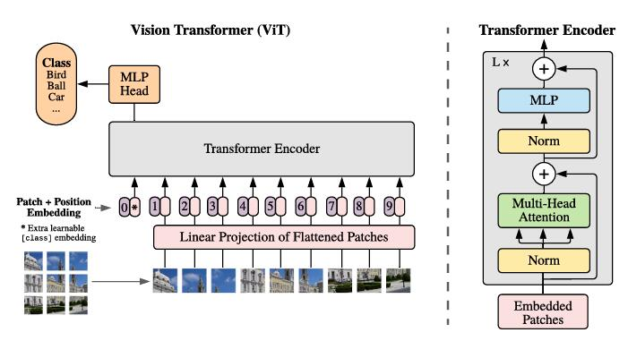
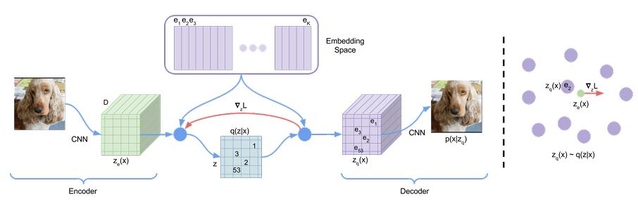

# MiniDream

> Implementing Sota CV, NLP, Speech and Multimodal Models with PyTorch

## 🌟 Features
- Pytorch
- Lightning

## 📦 Installation
```bash
git clone https://github.com/lemonmindyes/MiniDream.git
cd your_project
pip install -r requirements.txt
```

## 🚀 Usage
```bash
python train_mini_(model name).py # model name
```

##  📚 Model
- [x] [ResNet](https://arxiv.org/abs/1512.03385)
- [x] [VIT](https://arxiv.org/abs/2010.11929)
- [x] [VQ-VAE](https://arxiv.org/abs/1711.00937)

### ResNet
</img>
```python
import torch
from mini_resnet import Config, ResNet

config = Config()
# resnet18
config.n_layer = [2, 2, 2, 2]
config.resnet_name = 'resnet18'
resnet18 = ResNet(config)

# resnet34
config.n_layer = [3, 4, 6, 3]
config.resnet_name = 'resnet34'
resnet34 = ResNet(config)

# resnet50
config.n_layer = [3, 4, 6, 3]
config.resnet_name = 'resnet50'
resnet50 = ResNet(config)

# resnet101
config.n_layer = [3, 4, 23, 3]
config.resnet_name = 'resnet101'
resnet101 = ResNet(config)

# resnet152
config.n_layer = [3, 8, 36, 3]
config.resnet_name = 'resnet152'
resnet152 = ResNet(config)

img = torch.randn(1, 3, 224, 224)
out = resnet18(img) # out [1, num_class]
```

### VIT
</img>
```python
import torch
from mini_vit import Config, VIT

config = Config()
config.num_class = 1000
model = VIT(config)

img = torch.randn(1, 3, 224, 224)
out = model(img) # out [1, num_class]
```

### VQ-VAE
</img>
```python
import torch
from mini_vqvae import Config, VQVAE

config = Config()
model = VQVAE(config)

img = torch.randn(1, 3, 224, 224)
embedding_loss, x_hat, perplexity = model(img) # x_hat [1, 3, 224, 224]
```


